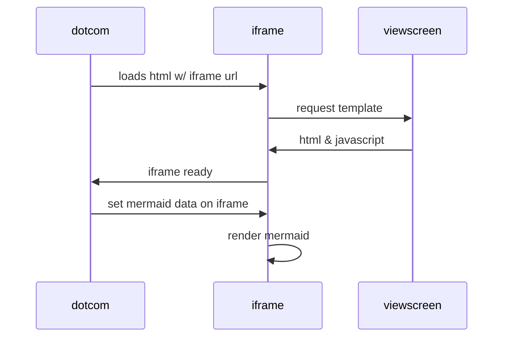

### Hi there 👋

I mostly work with Java, Bash, Kubernetes.

**I occasionally write some articles:**

- [`Difference b/w bashrc and bash_profile`](https://i.janardhanpulivarthi.com/season-2/bashrc-and-bash_profile)
- [`What is a core file`](https://i.janardhanpulivarthi.com/season-2/core-file)
- [`How to build a linux kernel`](https://i.janardhanpulivarthi.com/season-2/build-linux-kernel)

<!--
#### New github features:

also, some code

**The Cauchy-Schwarz Inequality**
$$\left( \sum_{k=1}^n a_k b_k \right)^2 \leq \left( \sum_{k=1}^n a_k^2 \right) \left( \sum_{k=1}^n b_k^2 \right)$$

-->

<!--
**j143/j143** is a ✨ _special_ ✨ repository because its `README.md` (this file) appears on your GitHub profile.

Here are some ideas to get you started:

- 🔭 I’m currently working on ...
- 🌱 I’m currently learning ...
- 👯 I’m looking to collaborate on ...
- 🤔 I’m looking for help with ...
- 💬 Ask me about ...
- 📫 How to reach me: ...
- 😄 Pronouns: ...
- ⚡ Fun fact: ...
-->
